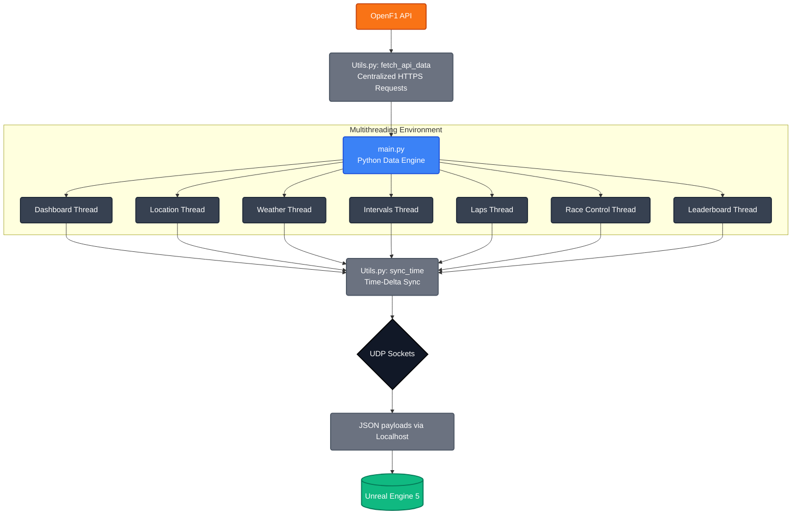

# F1Companion

## Overview
This project is a Python-based backend application designed to fetch, process, and transmit Formula 1 telemetry and tracking data. By utilizing the OpenF1 API, the system downloads historical race data and replays it by simulating a real-time environment. It acts as a reliable, asynchronous data provider for downstream applications, bypassing the limitations and authentication barriers of official live-timing servers.

## Purpose
The primary objective of this project is to serve as a robust data pipeline for real-time 3D rendering engines, specifically targeting integration with Unreal Engine. By broadcasting parsed spatial coordinates and car telemetry via local network protocols, it allows for the accurate simulation and visualization of F1 vehicles on a 3D track environment, complete with synchronized dashboard data and weather updates.

## Core Features
*   **Dynamic Time Synchronization:** Replaces static delays with a dynamic delta-time calculation engine. By parsing exact timestamp differences between JSON packets, the system guarantees that data is replayed at the precise frequency of the original real-world event.
*   **Concurrent Execution:** Utilizes Python's native multithreading capabilities to run separate, non-blocking data streams simultaneously. Spatial coordinates, car telemetry (speed, RPM, gears, throttle, brake), and weather conditions are processed in parallel without execution bottlenecks.
*   **Automated Data Filtering:** Features built-in logic to handle null values, missing timestamps, and idle car states (e.g., ignoring GPS packets when the vehicle is stationary in the garage), optimizing CPU usage and network payload.
*   **UDP Socket Broadcasting:** Formats the processed data into lightweight JSON payloads and transmits them via UDP sockets, ensuring low-latency communication suitable for real-time graphics engines.

## Technical Stack
*   **Language:** Python 3.x
*   **Libraries:** `requests`, `threading`, `socket`, `json`, `datetime`, `time`, `sys`
*   **Network Protocol:** UDP (User Datagram Protocol) over localhost (127.0.0.1)

## System Design

## Development Note
This software was developed entirely through manual coding, relying on independent research, debugging, and standard software engineering practices. No Artificial Intelligence tools were used to generate the source code. The use of AI was strictly limited to theoretical consultation regarding high-level architectural patterns—specifically concurrent execution models, dynamic time-delta synchronization, and local network routing—to bridge the gap between standard undergraduate computer science curricula and advanced real-time systems design. 
